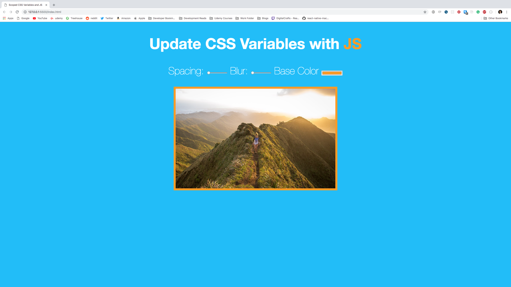

# Simple CSS Varible changer project using vanilla JavaScript

* Created CSS3 Varibles.
* used DOM style manipulation with javascript to change values.
* used html data tags in order to control suffix. 

## Screenshot

